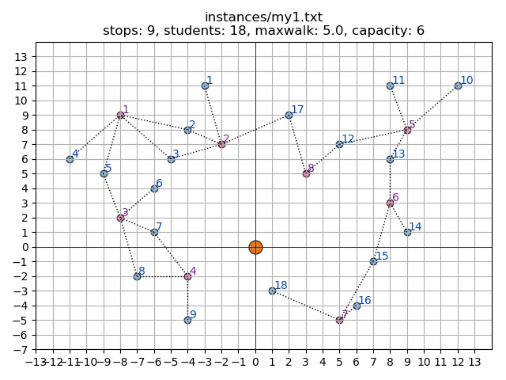

# School bus routing problem with bus stop selection

Capacitance Vehicle Routing Problem


## Problem definition

School bus routing problem, described in these instructions, is a variation of the vehicle routing problem. Unlike vehicle routing problem, where all the stops are known, and routes should be determined, in school bus routing problem only *potential* stops are given, and selection of stops and determining bus routes depends on students’ locations and capacity of each bus.


**The goal** of solving this problem is:

1. to determine the set of stops to visit,
2. determine for each student which stop (s)he should walk to, and
3. determine routes that lie along the chosen stops, so that the total travelled distance is minimized.

## Implementation of algorithm

To solve this problem, algorithm was designed. *Python* was choosen as a language of conduction, along with *Numpy* and *Matplotlib* packages. Program is constructed in modular way, so it can be roughly re-used. The main routing code is inside **router.py** file.

### Startup

The algorithm starts when input data is fed into it. To do it, it is needed to create a class and provide input file, e.g.:

```python
instance = router . Router('instances/sbr1, txt')
```

Class accepts provided input file format, and then process it, creating two dictionaries:

* *stops* – pair of **stop_id** and its coordinates. Returns dictionary:
```python
dict ( <stop id> : [x, y ],
       <stop id> : [x, y ], ...
       ...
     )
```

* *students* – pair of **student_id** and its **coordinates**. Returns dictionary:
```python
dict ( <student id> : set ( <stop id >, <stop id >, <stop id >, ... )
       <student id> : set ( <stop id >, <stop id >, <stop id >, ... )
       ...
     )
```


After this first steps, additional helper variables are created:

* *student near stops* – set of feasible stops for this student (where walking distance is less
than maximum walk distance). Returns dictionary of pairs:
```python
dict ( <student id> : set ( <stop id >, <stop id >, <stop id >, ... )
       <student id> : set ( <stop id >, <stop id >, <stop id >, ... )
       ...
     )
```


* **stop near stops** – calculated distances between stop and other stops. **distance** is float value.
```python
dict ( <stop id> : tuple ( tuple(<stop id >, <distance >) , tuple(<stop id >, <distance >) , ... )
       <stop id> : tuple ( tuple(<stop id >, <distance >) , tuple(<stop id >, <distance >) , ... )
       ...
     )
```

* **stop near students** – set of students feasible to pick up on this stop.
```python
dict ( <stop id> : set ( <student id >, <student id >, <student id >, ... )
       <stop id> : set ( <student id >, <student id >, <student id >, ... )
       ...
     )
```


### Routing algorithm

Main algorithm part consists of two loops, one inside another. It starts with creating
additional variables such as global route list or students available to pick up.


#### Outer loop

Outer loop manage choice of next stop and deal with "local" stop list (that is, a list where
one route will be written to). Loop breaks when all of the students were picked up (=list of
students is empty). Also, it appends local route list to global route list.


#### Inner loop

Inner loop consists the most load-intensive procedures. It will consecutively:

* check next stop and break the loop
* check capacity of bus
* take students available to particular stop, bearing in mind that they could be assigned only to this stop, so taking them first
* adding current stop to local stop list
* set new stop

Important question is how first and next stops are selected. This is where heurstic algorithm comes – first stop is taken randomly (in "outer loop"). Then, the following stops are selected in greedy way – in accordance to their distance (the closest stop to current is choosen), capacity (if current bus capacity could take students which are assigned only to suggested stop), and distance from base stop.


In the end, algorithm returns two lists:

* global path list – list of calculated routes.
```python
list([ [<stop id >, <stop id >, ... ],
       [<stop id >, <stop id >, ... ],
       ...
     ])
```

* global students dict – dictionary of key-value pairs which describe which student is assigned to which stop.
```python
dict ( <student id> : <stop id >,
       <student id> : <stop id >,
       ...
     )
```

### Simple-case example

Simple case example (*my1.txt*) was created to debug designed algorithm. Overall operation of the routing algorithm is easily visible on the following images (1, 2, 3):




 and routes (red)")

### Generating routes for given instances

Another script (**generate_sbr_routes.py**) is written to conduct instance calculations. It loops through the instances directory and takes every instance file to work on.


Subsequently, it execute routing algorithm a certain number of times (depending on given contraints), saving the shorest path generated along with students assignment list.

## Summary
Routing algorithm for problem **capacitance vehicle routing problem** was written in Python language. Code of algorithm consists files router.py, generate all sbr.py and additional *generate_my_images.py* for testing and debuggin purposes. It can be described as *Multistart local search + greedy* algorithm.


For given set of data it returns feasible solutions which are saved in "results" directory. Addidtional "results.txt" file is provided to give overall knowledge about time constraints and calculated distance.


Algorithm could be improved by caching and observing load-intensive parts to optimize them. Heuristics itself is very simple – it could be improved by adding e.g. [2-opt](https://en.wikipedia.org/wiki/2-opt) or [3-opt](https://en.wikipedia.org/wiki/3-opt) operators. Additional elements might be added to cache unfeasible solutions, making the algorithm "tabu search".


